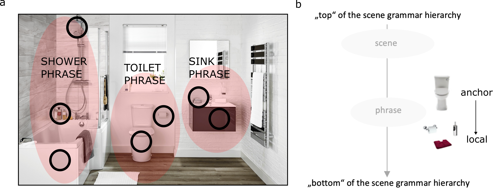
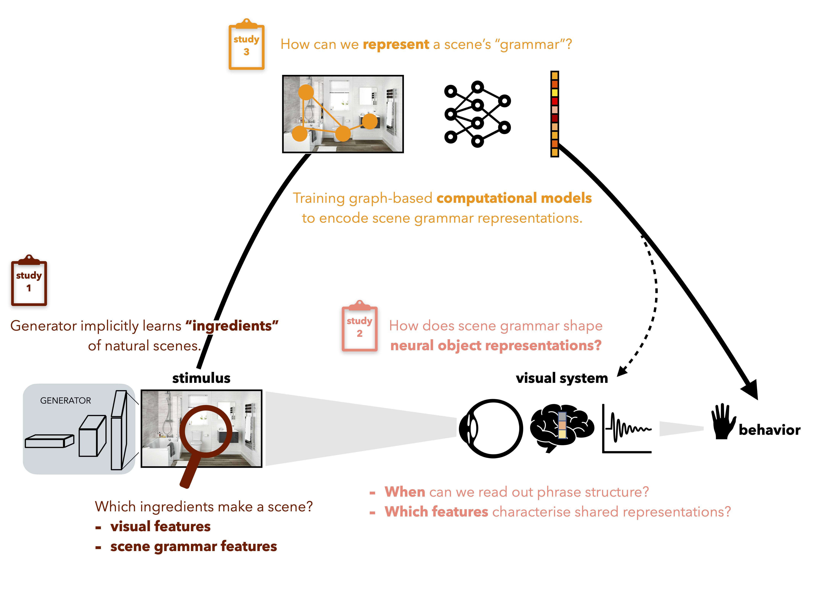

# 🧠 Lab Books

Welcome to my Lab Books, a collection of research projects I worked on during my PhD at the [Scene Grammar Lab](https://www.scenegrammarlab.com/) (2021–2025). This site serves as a living documentation of my work, including project descriptions, code, tutorials, and materials.

🚧 Work in Progress: I'm continuously updating tutorials, refining explanations, and adding new content, so be sure to check back regularly!

## 🔍 What You’ll Find Here

Each project has its own dedicated page, providing:

- 📖 A detailed project description
- 🖥️ Links to code repositories and datasets
- 🔗 Additional resources and materials

Additionally, I have created [tutorial notebooks] for EEG preprocessing using mne python, EEG decoding using mne python + sklearn, and RSA.

### ⌨️ Explore Tutorials
- [Tutorial EEG preprocessing](tutorials/eeg-preprocessing.md)
- [Tutorial EEG decoding](tutorials/eeg-decoding.md)
- [Tutorial RSA](tutorials/rsa.md)

## Projects Overview

I will start first with a broad introduction to the general motivation behind my projects - the broader questions and "red thread" linking everything together. 

Visual perception seems effortless – most of us do not feel like we expend much energy simply perceiving the world around us; we just do. However, inferring external world states from mere observations is a computationally complex task – like recognizing a friend’s face in a crowded room or identifying a familiar object in poor lighting. This process involves transforming sensory information (light entering through the retina) into behaviorally relevant neural representations. Since perceiving our surroundings is vital, this transformation must happen quickly and automatically, despite being constrained by limited energy resources. During this process, the visual system must deal with ambiguity caused by, for example, limited views due to occlusion, poor lighting, or clutter, to form accurate, efficient, and robust representations of its surroundings. But the visual world is not random; there is regularity in the way light reflects off surfaces, as well as in how we design our environments, the objects
we use, and how we arrange them.

In the **"Scene Grammar"**  framework scenes are characterized by “phrases”: clusters of frequently
co-occuring objects. At the top of the hierarchy lies the scene category. Anchor objects (e.g., toilet) at the top of the phrase hierarchy are predictive of the presence and location of surrounding smaller local objects (e.g., toilet paper) at the
bottom of the hierarchy.

I examine the role of scene grammar through three approaches: analyzing features in images generated by Generative Adversarial Networks (GANs) to understand how the visual system utilizes anchor objects and the distribution of visual features in real-world scenes for rapid interpretation (**Project 1**). Second, by exploring the temporal dynamics of phrase-specific neural representations during object perception using EEG (**Project 2**). And third, by developing a computational model for scene grammar using graph autoencoders, which learn to embed scenes into low-dimensional representations based on the scene's objects and their relationships (**Project 3**). Together, these approaches provide insight into how scene grammar shapes both behavioral and neural responses during object and scene processing by influencing
the formation of behaviorally relevant neural representations. This helps us understand how structured relationships between objects contribute to efficient and rapid visual perception.

### 🚀 Explore the Projects

Click on a project to learn more!

- [Project 1](projects/project-1.md)
- [Project 2](projects/project-2.md)
- [Project 3](projects/project-3.md)