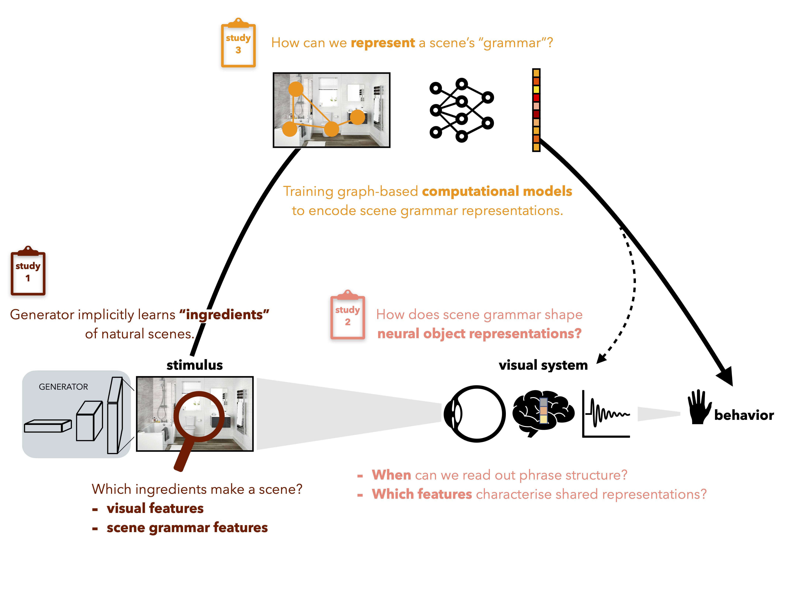

# 🧠 Lab Books

Welcome to my Lab Books, a collection of research projects I worked on during my PhD at the [Scene Grammar Lab](https://www.scenegrammarlab.com/) (2021–2025). This site serves as a living documentation of my work, including project descriptions, code, tutorials, and materials.

🚧 Work in Progress: I'm continuously updating tutorials, refining explanations, and adding new content, so be sure to check back regularly!

## 🔍 What You’ll Find Here

Each project has its own dedicated page, providing:

- 📖 A detailed project description
- 🖥️ Links to code repositories and datasets
- 📑 Tutorials & explanatory notebooks
- 🔗 Additional resources and materials

## Project Overview

- **Project 1**: Examines how generative models implicitly learn natural scene "ingredients" by identifying key visual and scene grammar features that define a scene, based on human behavioral responses.
- **Project 2**: Investigates how scene grammar shapes neural object representations, focusing on temporal dynamics and shared representations within object phrases.
- **Project 3**: Develops graph-based computational models to encode scene grammar and validates them using human judgments of systematic scene grammar violations.

## 🚀 Explore the Projects

Click on a project to learn more!

- [Project 1](projects/project-1.md)
- [Project 2](projects/project-2.md)
- [Project 3](projects/project-3.md)
