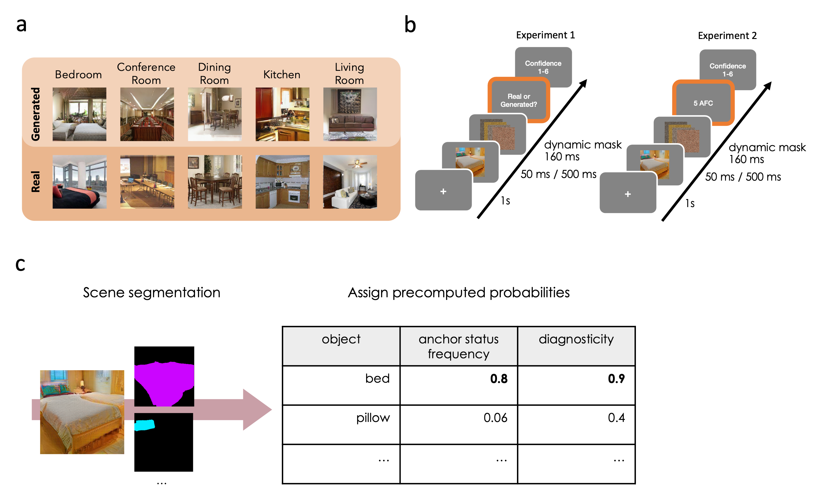
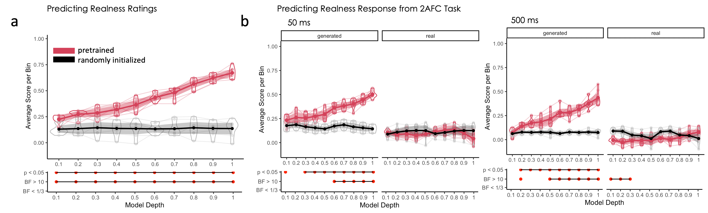
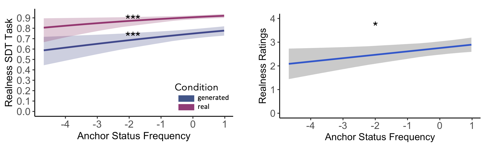
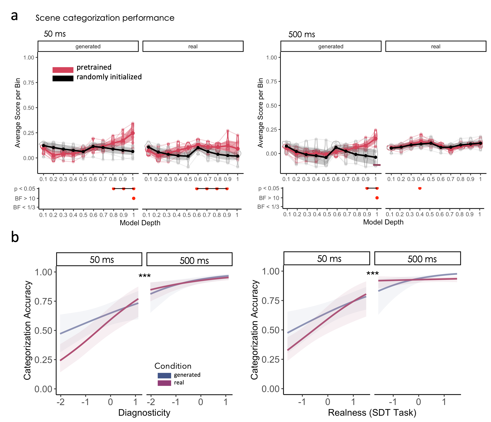

# Project 1: Anchor objects drive realism while diagnostic objects drive categorization in GAN generated scenes

Read the paper: [Link to paper](https://www.nature.com/articles/s44271-024-00119-z)

## 📖 Description
Our visual world is incredibly complex, yet we effortlessly make sense of it. How does the brain achieve this? This project explores how different objects within a scene contribute to our perception of realism and scene categorization. Specifically, we distinguish between anchor objects, which provide spatial cues for frequently co-occurring objects, and diagnostic objects, which help define the broader scene context.

Using Generative Adversarial Networks (GANs) to generate diverse indoor scenes, we examined how human observers and deep neural networks (DNNs) process these elements. Our findings reveal that anchor objects and high-level visual features play a key role in determining a scene’s realism, while diagnostic objects primarily drive categorization, even when realism is compromised. This highlights the brain’s ability to flexibly rely on different sources of information to make sense of its surroundings.

This project sheds light on how scene understanding emerges from the interplay between object-level information and broader spatial or semantic cues, offering insights into both human perception and artificial vision systems.

### Experiment Overview and Methodology

**a) Real and Generated Scene Images**. This study utilized both real and GAN-generated images to investigate scene perception. Real images were selected from the LSUN dataset, while generated images were produced using Progressive GANs, each trained on five different LSUN scene categories (Bedroom, Conference Room, Dining Room, Kitchen, Living Room). A total of 30 real and 30 generated images per category were used.

**b) Experimental Procedure**. The study involved two experiments with different tasks but identical stimulus presentation:

- Experiment 1: Participants judged whether an image was real or generated, followed by a confidence rating (1-6).
- Experiment 2: Participants categorized the scene into one of five categories (5-alternative forced choice task), again followed  by a confidence rating.

In both experiments, each trial followed a structured sequence, including a brief stimulus presentation (50 ms / 500 ms), dynamic masking (160 ms), and response collection.

**c) Scene Segmentation and Object Properties**. To analyze object contributions to scene understanding, each image underwent automated scene segmentation using a neural network trained on scene segmentation. Identified objects were then matched with a database containing precomputed anchor frequency and diagnosticity scores. Anchor objects (e.g., a bed in a bedroom) provide spatial predictions for frequently co-occurring objects. Diagnostic objects (e.g., a bed in a bedroom, but not necessarily a chair) contribute to scene categorization. Each scene received a maximum anchor and diagnosticity score from its detected objects to quantify its structural and semantic composition.

### Results - Experiment 1 (Visual Features)

**a) Predicting Realness Ratings from DNN Features**
- Feature maps were extracted from deep neural networks (DNNs) trained on scene and object classification.
- Pretrained models (red) significantly outperformed randomly initialized models (black) in predicting realness ratings.
- The x-axis represents model depth (earliest to deepest layers).
- 95% confidence intervals were bootstrapped from 1000 resamples.

**b) Predicting Responses in the 2AFC Task**
- The same method was applied to predict responses in the signal detection task.
- Results are shown separately for 50 ms and 500 ms conditions.
- Statistical indicators include p-values and Bayes Factors for comparisons between trained and untrained networks.

### Results - Experiment 1 (Anchor Effect)

**Effect of Anchor Objects on Realness Perception**

- **Left:** Realness responses in the signal detection task (SDT) (1 = real, 0 = generated) show a significant effect of anchor status frequency.
- **Right:** Realness ratings also show a significant relationship with anchor status frequency.

### Results - Experiment 2 (Scene Categorization)

**a) Predicting Categorization Performance from DNN Features**

- We extracted layer-wise feature maps from deep neural networks (DNNs) trained on scene and object classification.
- Pretrained models (red) significantly outperformed randomly initialized models (black) in predicting categorization accuracy for generated images.

**b) Effects of Diagnosticity, Presentation Duration, and Realness**

- **Left:** Categorization accuracy improves with higher diagnosticity, with significant differences at 50 ms.
- **Right:** Categorization accuracy is strongly correlated with realness (SDT Task), particularly at 50 ms.

### Summary of Findings

Our study highlights the distinct roles of anchor and diagnostic objects in scene perception: Anchor objects play a crucial role in perceived realness, significantly influencing whether a scene is judged as real or generated. Diagnostic objects, while essential for scene categorization, had limited impact on realness judgments, as their function is more tied to category-specific information.
Computational modeling revealed that high-level visual features, including object configurations, explained up to 60% of the variance in realness judgments. This emphasizes the importance of object parts and entire objects in early scene processing. We propose that anchor objects contribute to the distribution of high-level visual features in a scene due to their size and consistent spatial location. These findings offer new insights into how the visual system efficiently interprets scenes, leveraging the natural spatial and statistical structure of real-world environments.

## 🖥️ Repository

All materials (experimental files, data, code) can be found via this [OSF repository](https://osf.io/x2rbq/?view_only=fbdb72f4a8904f9dae6d39d3e02f7cb5).

## 📑 Tutorial Notebooks

Coming soon...
