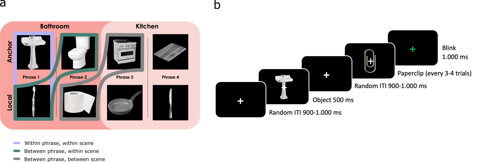
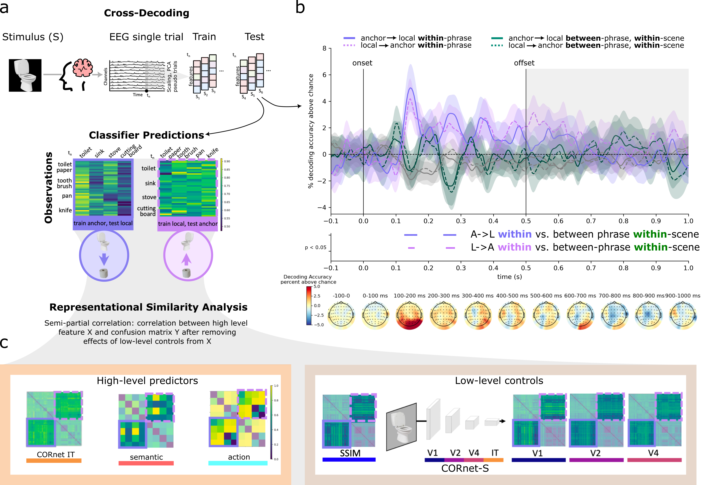
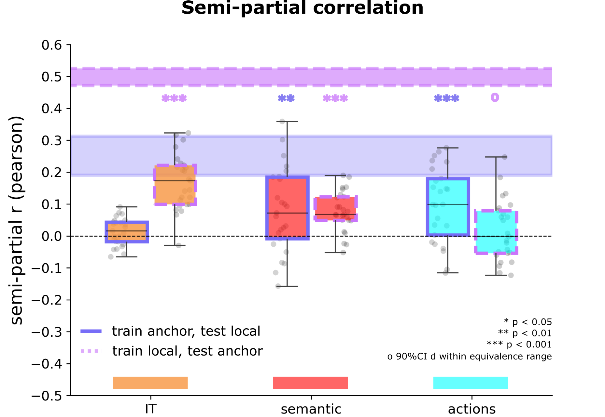

# Project 2: Object representations reflect hierarchical scene structure and depend on high-level visual, semantic, and action information.

Read the paper: [Link to paper](https://osf.io/preprints/psyarxiv/hs835_v1)

## 📖 Description
This study examines how phrases—clusters of local objects organized around an anchor—are reflected in neural responses during object perception using EEG. Building on evidence that object and scene processing are highly interactive, the study explores whether objects within the same phrase elicit more similar neural activation patterns than those from different phrases within the same scene. Additionally, it investigates the shared features driving these representations and examines whether anchor and local objects exhibit similar neural feature encoding within scene grammar hierarchies.

### Stimuli and Experimental Design

**a) Stimuli:** The set included 8 object categories (10 exemplars each) from two scene categories (bathroom, kitchen), organized into four phrases, each containing an anchor and a local object. Colored boxes indicate object similarity levels.

**b) Task:** Participants responded when a paperclip appeared. Trials containing paperclips were excluded from analysis.

### Cross-Decoding Methods and Results

**a) Multivariate Pattern Analysis (MVPA) Cross-Classification Framework:** SVM classifiers with linear kernels were trained on either anchor or local objects and then tested on held-out trials. The classifier predictions were organized into confusion matrices for both training-to-testing directions.

**b) Cross-Classification Results:** Generalization performance within phrases (between anchor and local objects) was compared to generalization between phrases within the same scene. The figure marks image onset and offset times, with shaded areas showing standard error. Horizontal bars indicate significant differences (within vs. between classification scores) based on one-sided cluster-based permutation t-tests (10,000 permutations, cluster-definition threshold at p < 0.05).

**c) High-Level and Low-Level Predictor RDMs:** High-level predictor RDMs include CORnet-IT, semantic similarity from GPT2 features, and implied actions. Low-level control RDMs consist of structural similarity (SSIM) and CORnet-S layer RDMs for V1, V2, and V4.

### RSA results

We averaged correlation coefficients (semipartial correlation) from the significant phrase-specific cross-classification cluster and tested them against zero using one-sample t-tests (one-sided). Bonferroni correction was applied to p-values, and non-significant results were further examined with inferiority tests. In the boxplots, horizontal black bars indicate the median, points represent individual participants, and filled bars show noise ceilings.

### Summary of Findings

**Phrase-Specific Neural Representations:** Objects within the same phrase share high-level semantic similarity and implied actions, beyond low-level visual features. These representations emerge early in visual processing (128–164 ms), showing the brain’s efficiency in integrating high-level features. 

**Scene Grammar Hierarchy Effects:**
Anchor objects (top of hierarchy) activate feature sets shared with spatially, functionally, and semantically related objects, facilitating efficient perception.
Local objects (bottom of hierarchy) engage feature sets linked to their anchor objects whose visual features are encoded in high-level representations of the local object. 

The contribution of GPT embeddings suggests that the way objects are structured in language reflects their real-world spatial and functional relationships, reinforcing the role of co-occurrence statistics in shaping object representations.

## 🖥️ Repository

All code as well as preprocessed EEG files can be found via this [github repository](https://github.com/aylinsgl/sg-phrase-cross-decoding).

## 📑 Tutorial Notebooks

Coming soon...