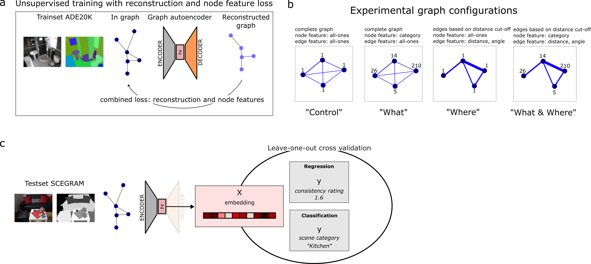
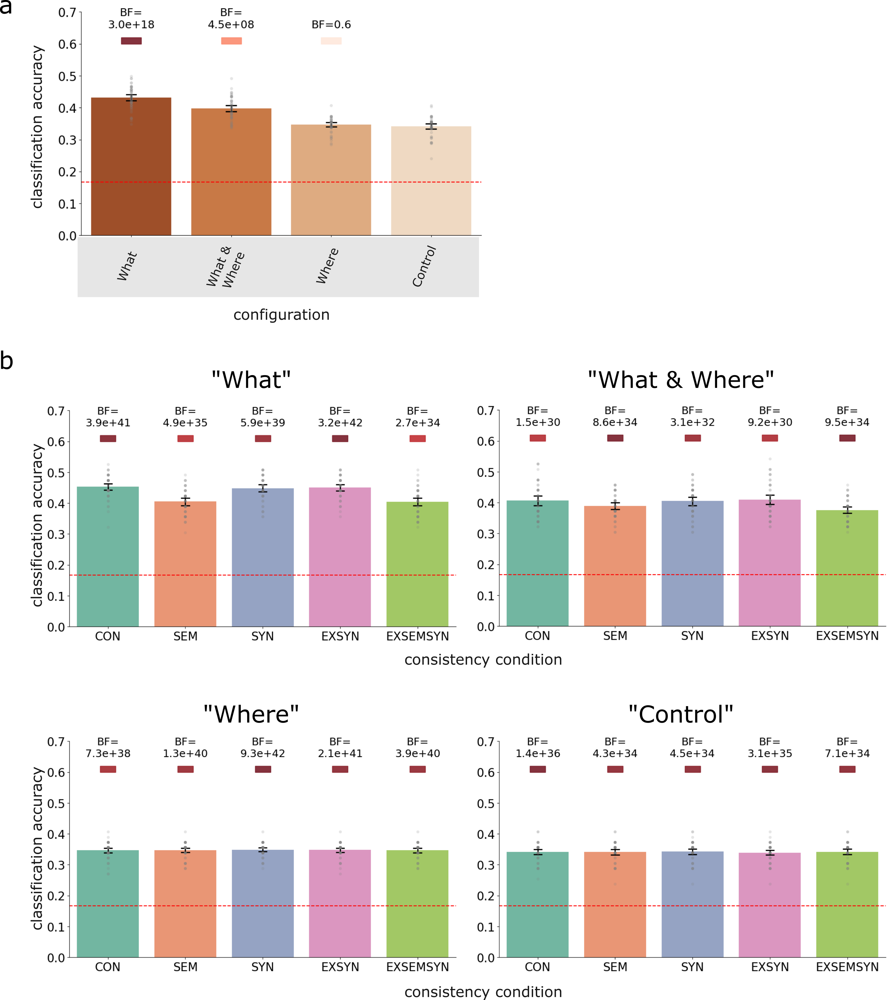
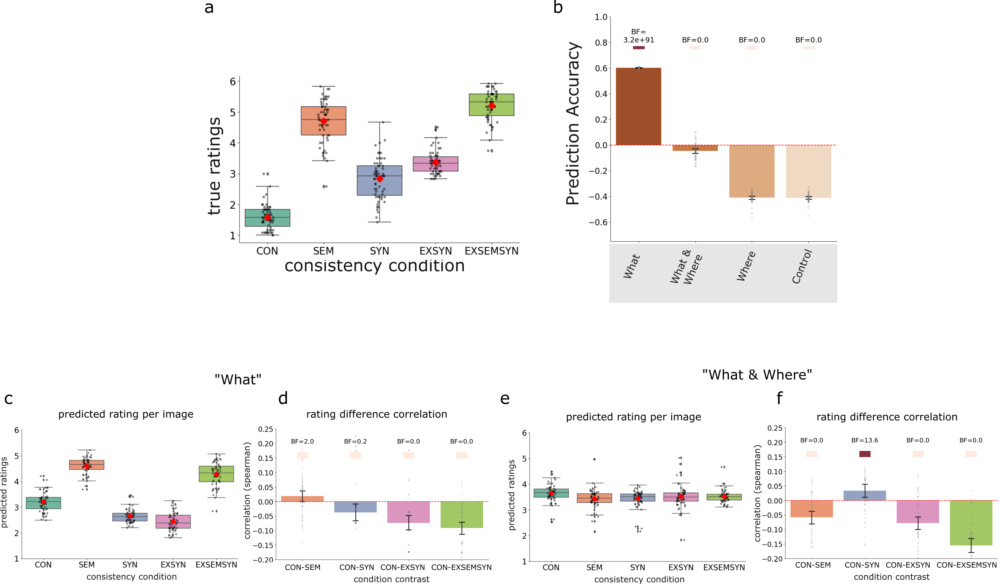
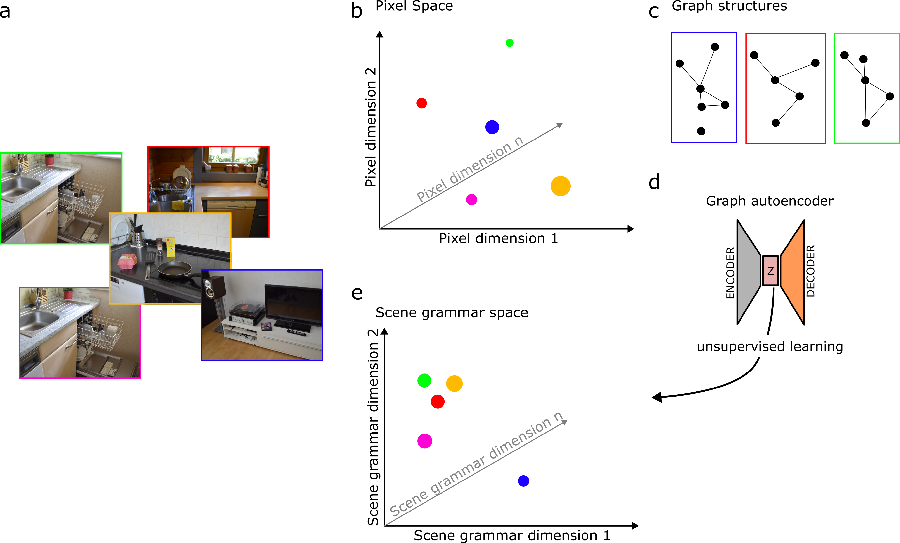

# Project 3: Predicting Human Perception of Scene Consistencies Using Graph Representations of Scene Grammar

Read the paper: [Link to paper](https://www.dropbox.com/scl/fi/1fuu3vtr5vss4wjzeiyyw/kallmayer_comp_scene_grammar_manuscript.pdf?rlkey=qa3um43ouh763ojhowl4rqfs2&st=aa93fkoj&dl=0)

## 📖 Description
This study uses graph autoencoders (GAEs) to learn low-dimensional embeddings that capture variations in object identity ("what") and spatial relationships ("where") in real-world scenes through unsupervised learning. Using the SCEGRAM database, which includes systematic violations of object identity and spatial relationships, the embeddings are evaluated on categorization and consistency rating tasks to assess whether they implicitly encode scene category and reflect human-like consistency effects. By comparing different semantic and spatial configurations, this study demonstrates a proof of concept for modeling scene grammar with interpretable graph-based representations.

### Modelling Overview

**a) Unsupervised training** with reconstruction and node feature loss. 

**b) Experimental and control graph configurations.** Four configurations were designed to capture varying degrees of scene information. 

**c) Testing on SCEGRAM dataset.** Embeddings from the SCEGRAM images are used as input features for downstream estimation
tasks: scene classification (predicting scene categories) and predicting scene consistency ratings.

### Classification Results

**a) Overall classification accuracy for each graph configuration** (“What“, “What & Where“, “Where“, and “Control“). Bayes Factors are shown for comparisons against the control condition.

**b) Classification accuracy across individual consistency conditions** (CON = consistent, SEM = semantic violation, SYN = syntactic violation, EXSYN = extreme syntactic violation, EXSEMSYN = extreme semantic and syntactic violation) for each graph configuration. Bayes factor values (BF) are shown as colored squares above each condition. The color intensity represents the strength of evidence, scaled logarithmically and visualized on a “Reds“ color scale. Bayes factors greater than 10, indicating strong evidence, are represented with progressively darker reds. For BF values less than or equal to 10, a light red color
is used to denote weaker evidence. Error bars represent 95% confidence intervals, and the results are averaged over 50 training runs.

### Ratings Results

**a) Human consistency ratings across different scene conditions:** CON (consistent), SEM (semantic violation), SYN (syntactic violation), EXSYN (extreme syntactic violation), and EXSEMSYN (extreme semantic and syntactic violation). Ratings reflect the degree to which scenes were perceived as consistent or inconsistent by human observers, with higher values indicating greater perceived inconsistency. 

**b) Prediction accuracy** of the graph autoencoder embeddings for scene consistency ratings across different graph configurations: “What”, “What & Where”, “Where”, and “Control”. Bayes factors (BF) indicate evidence strength for a positive correlation in each configuration. Error bars represent 95% confidence intervals. 

**c-f) Contrast correlation results.** (c,d) What configuration (e,f) “What & Where” configuration. (c,e) Predicted consistency ratings for each scene condition across consistency conditions. (d,f) Correlation (Spearman) between the differences in human
ratings and differences in embeddings for each condition contrast (e.g., CON vs. SEM). Positive correlations indicate that embedding differences align with rating differences for the given contrast. Bayes factors (BF) are displayed above each bar to indicate the strength of evidence for each correlation. Dots represent correlations for individual runs. Errorbars represent 95%
confidence intervals.

### Summary of Findings

- What graph detected semantic inconsistencies.
- What & Where graph captured structural consistency but not semantic violations.
- Where graph (spatial-only) failed to predict meaningful scene structure, emphasizing the importance of object identity in scene categorization and consistency expectations.
- Predicting consistency ratings was challenging due to their subjective nature, but embeddings partially approximated human judgments. 

**Scene grammar as statistical appearance model:** 

**a) Images from two scene categories** (kitchen and living room), including one image with a semantic violation (toilet
paper in a dishwasher). 

**b)** In pixel space, these images are not easily separable by category,
and violations are not readily detectable. 

**c) Graph representations** capture the object-level structure of the scenes. 

**d) Unsupervised learning** on graph structures using a graph autoencoder learns scene grammar representations – statistical appearance models at the object level. 

**e)** These representations more explicitly separate image categories and are sensitive to violations of learned expectations about object identity and spatial relationships.

## 🖥️ Repository

All code can be found via this [github repository](...).

## 📑 Tutorial Notebooks

Coming soon...